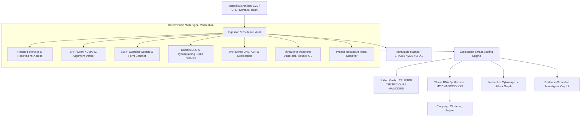

# MailTracer.ai

### AI-Powered Email Threat Detection, Website Verification, Geolocation & Digital Forensic Intelligence Platform

> **Verify. Trace. Investigate. Protect.**

[](https://nextjs.org/)
[](https://www.typescriptlang.org/)
[](https://www.prisma.io/)
[](https://js.cytoscape.org/)
[](https://vitest.dev/)
[]()

---

## 1. Overview & Problem Statement

Modern phishing, Business Email Compromise (BEC), and digital credential harvesting have evolved beyond simple keyword filters. Attackers routinely deploy lookalike domains, weaponized redirect chains, compromised legitimate email servers, and social engineering lures. 

Traditional email security gateways frequently fail when facing:
1. **DMARC Non-Alignment**: Sender display names spoofing executives while bypassing naive filters.
2. **Deceptive Lookalike Infrastructure**: Domains registered with homoglyphs or brand affixes (e.g. `microsoft-verify-portal.net`).
3. **Weaponized Landing Pages**: Websites hosted on HTTPS with valid certificates that harvest credentials through interactive forms.
4. **AI Hallucinations in SecOps**: Analysts receiving ungrounded, unverified AI assertions without cryptographic chain-of-custody.

**MailTracer.ai** solves this by establishing a multi-layered, deterministic cyber forensics and intelligence platform. It synthesizes email header forensics, cryptographic SPF/DKIM/DMARC verification, SSRF-guarded website scanning, Threat DNA fingerprinting, Cytoscape.js attack graphs, and evidence-grounded AI copilot reasoning.

---

## 2. Core Architecture & System Data Flow



---

## 3. Platform Capabilities & Key Features

### 📧 1. Deep RFC5322 & MIME Email Forensics
- Parses multi-line continuation headers, MIME multipart boundaries, and attachments.
- Traces chronological `Received` hops from origin MTA to recipient mailbox.
- Computes SHA256, MD5, and SHA1 evidence hashes for immutable chain of custody.

### 🛡️ 2. Cryptographic Authentication & DMARC Alignment
- Interrogates live DNS SPF TXT records and evaluates authorized sender IPs.
- Verifies DKIM selector signatures (`s=`, `d=`).
- Computes RFC 7489 DMARC identifier alignment between visible `From` and envelope domains.

### 🌐 3. SSRF-Guarded Website & Credential Scanner
- **Mandatory SSRF Controls**: Blocks loopback (`127.0.0.1`, `::1`), RFC1918 private subnets (`10.0.0.0/8`, `172.16.0.0/12`, `192.168.0.0/16`), and cloud metadata (`169.254.169.254`).
- Inspects TLS certificates (`issuer`, `subject`, `validTo`, `isTrusted`).
- Identifies credential harvesting `<form>` elements and `<input type="password">` fields.
- **The Golden Rule (Section 17)**: *A website is NOT trusted merely because HTTPS = YES or Certificate = VALID.*

### 🔍 4. Domain Typosquatting & Lookalike Detection
- Algorithmic Levenshtein distance and homoglyph substitution analysis (e.g. `0` for `o`, `rn` for `m`, `1` for `l`).
- Identifies targeted impersonation against monitored enterprise brands (Microsoft, Google, PayPal, Apple, Chase, etc.).

### 🧬 5. Threat DNA Engine (`MT-DNA-XXXXXXXX`)
- Synthesizes 3 independent component fingerprints into an 8-character SOC reference code:
  1. `headerFingerprint`: Routing hop topology & authentication states.
  2. `infraFingerprint`: Sender MX domains & resolved ASN infrastructure.
  3. `contentFingerprint`: Lexical lure tokens, URL patterns, and attachment hashes.
- Matches similarity across historical investigations to group coordinated campaigns.

### 🕸️ 6. Cytoscape.js Interactive Attack Graph
- Full interactive graph modeling: `EMAIL → SENDER → DOMAIN → IP → ASN / COUNTRY → URL → ATTACHMENT → HASH → THREAT DNA → CAMPAIGN`.
- Real-time zoom, pan, layout resets, and node inspector drawer.

### 🤖 7. Evidence-Grounded Investigator Copilot
- RAG architecture strictly grounded in preserved database evidence.
- Prompt injection defense: Untrusted email content quarantined within `<untrusted_evidence_quarantine>` tags.
- Zero-hallucination policy: If evidence is unavailable, Copilot explicitly responds *"Insufficient evidence"* rather than inventing telemetry.

---

## 4. Verification Modes

The platform provides 6 distinct verification entry points from the home hub:
1. **Email Message**: Full EML or raw header paste analysis.
2. **Website URL**: Safe HTTP fetch, TLS check, and credential form inspection.
3. **Domain Intel**: DNS records (A, MX, TXT, NS) and lookalike brand analysis.
4. **IP Infrastructure**: Geolocation, reverse DNS, and ASN abuse profiling.
5. **File Hash**: MD5, SHA1, and SHA256 threat signature queries.
6. **Sender Identity**: Display name and DMARC alignment verification.

---

## 5. Technology Stack

| Layer | Technologies |
|---|---|
| **Frontend** | Next.js 16 (App Router), React 19, TypeScript 5, Tailwind CSS v4, Lucide Icons |
| **Styling** | Cyber SOC Dark Theme, custom radar sweeps, terminal scrollbars |
| **Visual Graph** | Cytoscape.js (Breadthfirst / CoSE layouts) |
| **Backend** | Next.js Route Handlers, Node.js DNS & TLS Sockets, Zod Validation |
| **Database & ORM** | Prisma 6, SQLite (`dev.db` for instant local dev), Neon PostgreSQL compatible |
| **AI & Heuristics** | OpenAI `gpt-4o-mini` with prompt quarantine + Deterministic Rule Fallback |
| **Testing** | Vitest automated unit testing suite |

---

## 6. Directory Structure

```text
mailtracer.ai/
├── app/                           # Next.js App Router
│   ├── layout.tsx                 # Root layout with SOC navbar
│   ├── page.tsx                   # Unified Verification Center
│   ├── globals.css                # SOC dark theme & radar styling
│   ├── dashboard/page.tsx         # Live SOC dashboard & telemetry feed
│   ├── cases/page.tsx             # Case management directory
│   ├── cases/[id]/                # 10-tab forensic investigation dossier
│   ├── threat-dna/page.tsx        # Threat DNA browser & similarity matcher
│   ├── campaigns/page.tsx         # Correlated attack campaigns
│   ├── attack-graph/page.tsx      # Standalone Cytoscape.js attack graph
│   ├── geo-intelligence/page.tsx  # Geolocation & ASN mapping
│   ├── reports/page.tsx           # Audit report generator & export
│   ├── copilot/page.tsx           # Dedicated AI Copilot workspace
│   ├── settings/page.tsx          # Security policies & provider status
│   └── api/                       # Secure REST API endpoints
├── components/                    # Modular React components
│   ├── soc-navbar.tsx             # Command bar & live status beacon
│   ├── demo-cases-modal.tsx       # Instant 4-scenario synthetic demo modal
│   ├── threat-score-gauge.tsx     # Score gauge with confidence meter
│   ├── verification-matrix.tsx    # Multi-signal verification table
│   ├── attack-graph-view.tsx      # Interactive Cytoscape.js canvas
│   ├── attack-story.tsx           # 5-point incident narrative breakdown
│   ├── evidence-vault.tsx         # Cryptographic hash verification cards
│   ├── timeline-view.tsx          # Transmission hops & detection timeline
│   └── copilot-chat.tsx           # Grounded Copilot Q&A interface
├── lib/                           # Core Forensic & Intelligence Engines
│   ├── db.ts                      # Prisma client singleton
│   ├── types.ts                   # Domain TypeScript definitions
│   ├── email-parser.ts            # RFC5322 MIME & header parsing
│   ├── auth-verifier.ts           # SPF / DKIM / DMARC verification
│   ├── ssrf-filter.ts             # Strict SSRF & private IP validator
│   ├── website-scanner.ts         # Safe HTTP fetch & TLS inspector
│   ├── domain-intel.ts            # DNS lookups & typosquatting detector
│   ├── ip-intel.ts                # Geolocation, reverse DNS, ASN
│   ├── threat-score.ts            # Explainable multi-signal threat scorer
│   ├── threat-dna.ts              # Algorithmic Threat DNA generator (MT-DNA-*)
│   ├── attack-graph.ts            # Cytoscape graph data generator
│   ├── seed-data.json             # 4 synthetic demonstration scenarios
│   ├── threat-intel/              # Extensible threat intel adapters
│   └── ai/                        # AI provider, prompt quarantine, Copilot RAG
├── ml/                            # Offline Machine Learning Pipeline
│   ├── datasets/                  # Open-source dataset docs
│   ├── preprocessing/clean.py     # Data cleaning & PII redaction
│   ├── features/extractor.py      # Multi-signal feature extraction
│   ├── training/train.py          # Model training scripts
│   └── evaluation/evaluate.py     # Evaluation metrics (Accuracy, F1, FPR, FNR)
├── prisma/                        # Database Schema (26 models)
│   └── schema.prisma
├── scripts/                       # Database seed and maintenance scripts
│   └── seed.mjs
├── tests/                         # Vitest automated test suite
├── docs/                          # 16 detailed architectural documents
├── TODO.md                        # Complete 32-phase progress checklist
└── .env.example                   # Environment variable template
```

---

## 7. Quick Start & Local Setup

### Prerequisites
- Node.js 20+ (Tested on v24)
- npm 10+

### Installation Steps

1. **Clone the Repository**:
   ```bash
   git clone https://github.com/stackshad0w/mailtracer.ai.git
   cd mailtracer.ai
   ```

2. **Install Dependencies**:
   ```bash
   npm install
   ```

3. **Configure Environment Variables**:
   Copy `.env.example` to `.env`:
   ```bash
   cp .env.example .env
   ```
   *(By default, SQLite is configured for instant zero-config functionality without external database credentials).*

4. **Initialize Database & Seed Demonstration Scenarios**:
   ```bash
   npm run db:push
   npm run seed
   ```

5. **Start Development Server**:
   ```bash
   npm run dev
   ```
   Open `http://localhost:3000` in your browser.

---

## 8. Demonstration Scenarios (Section 75)

MailTracer.ai includes 4 pre-configured synthetic cases clearly badged as `[DEMO / SYNTHETIC DATA]`:
1. **Case 1: Credential Phishing (`MT-CASE-2026-001`)**:
   - Impersonates Microsoft 365 Security with lookalike domain `microsoft-verify-portal.net`.
   - **Result**: Score 92/100, Verdict: **MALICIOUS**, Confidence: 96%.
2. **Case 2: Business Email Compromise / BEC (`MT-CASE-2026-002`)**:
   - Executive impersonation directing finance director to wire $142,500. Reply-To diversion.
   - **Result**: Score 82/100, Verdict: **HIGH_RISK**, Confidence: 91%.
3. **Case 3: Trojan Dropper Malware Delivery (`MT-CASE-2026-003`)**:
   - Macro-enabled workbook (`.xlsm`) delivering AgentTesla loader.
   - **Result**: Score 98/100, Verdict: **MALICIOUS**, Confidence: 99%.
4. **Case 4: Benign Corporate Communication (`MT-CASE-2026-004`)**:
   - Legitimate cloud security newsletter with valid SPF, DKIM, and DMARC alignment.
   - **Result**: Score 8/100, Verdict: **TRUSTED**, Confidence: 98%.

---

## 9. Testing & Quality Gate

Run automated test suites using Vitest:
```bash
npm run test
```
Tests validate:
- RFC5322 header parsing & hop extraction
- Strict SSRF filter rejection of private/loopback/cloud metadata IP ranges
- SPF & DMARC alignment logic
- Threat DNA deterministic synthesis (`MT-DNA-*`)
- Multi-signal threat score calculations

---

## 10. License & Legal Disclaimer

Distributed under the MIT License. 

**Defensive Security Use Notice**:
MailTracer.ai is designed exclusively for defensive cyber threat detection, incident response, and academic digital forensic research. Network inspection and website scanning tools enforce safe HTTP requests and strict SSRF restrictions.
