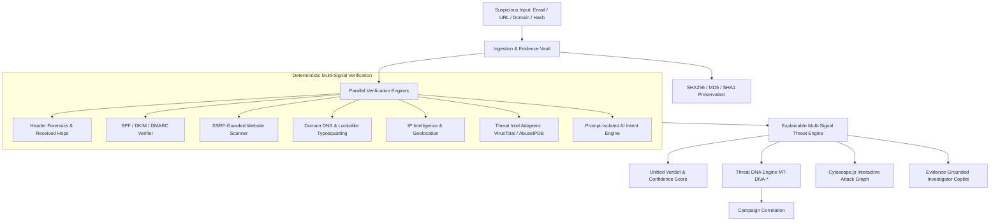

# MailTracer.ai System Architecture

## Overview
MailTracer.ai is an enterprise cyber forensics platform integrating multiple independent verification layers:

## Resilience & Graceful Degradation
- Zero dependence on single AI models or external vendor APIs.
- When external threat intelligence keys are unconfigured, status reports `"Status: Not configured"` cleanly without fake data.
- Built-in deterministic security heuristics ensure complete functionality in air-gapped or zero-API environments.
